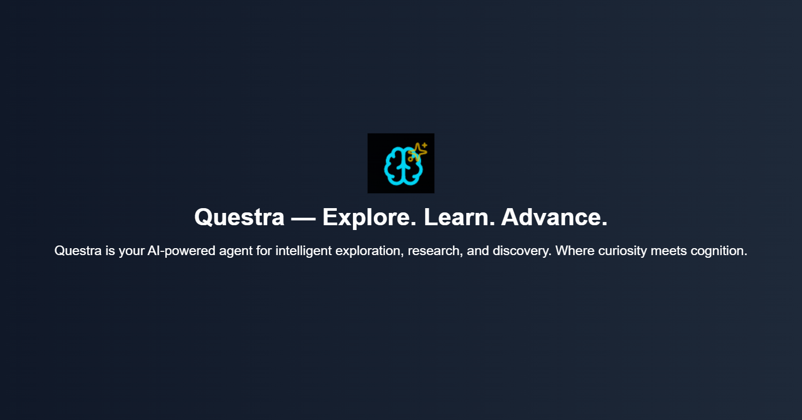

# Questra 🧠✨

> **AI-Powered Research Agent** - Transform any topic into comprehensive research reports with beautiful glassmorphism UI

<div align="center">
  
</div>

## 🌟 Overview

**Questra** is a modern, AI-powered research application that transforms any topic into comprehensive, structured research reports. Built with cutting-edge technologies and featuring a sleek glassmorphism design inspired by modern AI interfaces.

### ✨ Key Features

- 🔍 **Intelligent Web Research** - Powered by Tavily API for real-time web searching
- 🤖 **AI Summarization** - Google Gemini Flash 2.0 for intelligent content analysis
- 📄 **PDF Export** - One-click PDF generation with professional formatting
- 🎨 **Modern UI** - Glassmorphism design with dark theme aesthetics
- 📱 **Mobile Responsive** - Seamless experience across all devices
- ⚡ **Real-time Progress** - Visual feedback during research process
- 🛡️ **Error Handling** - Robust error management and fallback systems

## 🚀 Live Demo

Experience Questra in action: [**Live Demo**](https://questra.vercel.app)

## 🛠️ Technologies

### Frontend
- **Next.js 14** - React framework with App Router
- **React 18** - Modern React with hooks
- **Tailwind CSS** - Utility-first CSS framework
- **Lucide React** - Beautiful icon library
- **html2pdf.js** - Client-side PDF generation

### Backend APIs
- **Tavily Search API** - Advanced web search capabilities
- **Google Gemini Flash 2.0** - AI-powered content summarization
- **Next.js API Routes** - Serverless API endpoints

### Design System
- **Glassmorphism** - Modern glass-like UI effects
- **Dark Theme** - Elegant dark color palette
- **Responsive Design** - Mobile-first approach
- **Smooth Animations** - CSS transitions and transforms

## 📋 Prerequisites

Before running Questra, ensure you have:

- **Node.js** (v18 or higher)
- **npm** or **yarn** package manager
- **Tavily API Key** ([Get yours here](https://tavily.com/))
- **Google AI Studio API Key** ([Get yours here](https://makersuite.google.com/app/apikey))

## ⚡ Quick Start

### 1. Clone the Repository

```bash
git clone https://github.com/chaieeetanya433/questra-ai.git
cd questra
```

### 2. Install Dependencies

```bash
npm install
# or
yarn install
```

### 3. Environment Setup

Create a `.env.local` file in the root directory:

```env
# API Keys
GOOGLE_API_KEY=your_google_gemini_api_key_here
TAVILY_API_KEY=your_tavily_api_key_here

# Optional: Custom Configuration
NEXT_PUBLIC_APP_NAME=Questra
NEXT_PUBLIC_APP_VERSION=1.0.0
```

### 4. Run Development Server

```bash
npm run dev
# or
yarn dev
```

Open [http://localhost:3000](http://localhost:3000) to view Questra in your browser.

## 📁 Project Structure

```
questra/
├── app/
│   ├── api/
│   │   └── research/
│   │       └── route.js          # Main API endpoint
│   ├── globals.css               # Global styles
│   ├── layout.js                # Root layout
│   └── page.js                   # Main application component
├── lib/
│   ├── gemini.js                # Google Gemini integration
│   └── tavily.js                # Tavily search integration
├── public/                      # Static assets
├── .env.local                   # Environment variables
├── .gitignore                   # Git ignore rules
├── next.config.js               # Next.js configuration
├── package.json                 # Dependencies and scripts
├── tailwind.config.js           # Tailwind CSS configuration
└── README.md                    # This file
```

## 🔧 Configuration

### API Configuration

#### Tavily Search API
```javascript
// lib/tavily.js
const client = new TavilyClient(process.env.TAVILY_API_KEY);

export async function searchTopic(topic) {
    const res = await client.search(topic, { 
        max_results: 5,
        search_depth: "advanced"
    });
    return res.results.map((r) => r.content).join('\n\n');
}
```

#### Google Gemini API
```javascript
// lib/gemini.js
export async function summarizeContent(content, topic) {
    const url = `https://generativelanguage.googleapis.com/v1/models/gemini-2.5-flash:generateContent?key=${process.env.GOOGLE_API_KEY}`;
    
    const response = await fetch(url, {
        method: "POST",
        headers: { "Content-Type": "application/json" },
        body: JSON.stringify({
            contents: [{
                role: "user",
                parts: [{
                    text: `You're an expert researcher. Summarize the following content about "${topic}" into a structured report with headings:\n\n${content}`,
                }],
            }],
        }),
    });

    const data = await response.json();
    return data?.candidates?.[0]?.content?.parts?.[0]?.text ?? "No summary available.";
}
```

### Customization Options

#### Theme Colors
Modify `tailwind.config.js` to customize the color scheme:

```javascript
module.exports = {
  theme: {
    extend: {
      colors: {
        primary: {
          50: '#f0f9ff',
          500: '#06b6d4',
          900: '#0c4a6e',
        }
      }
    }
  }
}
```

#### UI Components
The main application component is highly customizable:

- **Background animations**: Modify the animated blur elements
- **Glassmorphism effects**: Adjust backdrop-blur and transparency
- **Typography**: Change font sizes and weights
- **Spacing**: Modify padding and margins

## 📱 Mobile Responsiveness

Questra is built with a mobile-first approach:

- **Responsive Typography**: Scales from mobile to desktop
- **Touch-Optimized**: Large touch targets and proper spacing
- **Adaptive Layout**: Flexible grid system
- **Performance Optimized**: Reduced animations on mobile

### Breakpoints
- `sm`: 640px and up
- `md`: 768px and up
- `lg`: 1024px and up
- `xl`: 1280px and up

## 🚀 Deployment

### Vercel (Recommended)

1. Push your code to GitHub
2. Connect your repository to [Vercel](https://vercel.com/)
3. Add environment variables in Vercel dashboard
4. Deploy with one click

### Other Platforms

#### Netlify
```bash
npm run build
npm run export
```

#### Traditional Hosting
```bash
npm run build
npm start
```

### Environment Variables for Production

Ensure these are set in your production environment:

```env
GOOGLE_API_KEY=your_production_google_api_key
TAVILY_API_KEY=your_production_tavily_api_key
```

## 🧪 Usage Examples

### Basic Research Query
```
Input: "Artificial Intelligence in Healthcare"
Output: Comprehensive report covering:
- Current applications
- Benefits and challenges
- Future prospects
- Key statistics and trends
```

### Advanced Research Topics
```
✅ "Quantum Computing Applications in Cryptography"
✅ "Sustainable Energy Solutions for Urban Development"
✅ "Machine Learning in Financial Fraud Detection"
✅ "Blockchain Technology in Supply Chain Management"
```

### PDF Export Features
- **Professional Formatting**: Clean, readable layout
- **Structured Content**: Headers, bullets, and paragraphs
- **Branded Headers**: Questra branding and generation date
- **Cross-platform**: Works on all devices and browsers

## 🔒 Security & Privacy

### Data Protection
- **No Data Storage**: Research data is not stored on servers
- **API Security**: Secure API key management
- **Client-side Processing**: PDF generation happens locally
- **HTTPS Only**: Secure data transmission

### Best Practices
- Keep API keys secure and never commit them to version control
- Regularly rotate API keys
- Monitor API usage to prevent abuse
- Implement rate limiting for production use

## 🤝 Contributing

We welcome contributions to Questra! Please follow these steps:

### Development Setup
1. Fork the repository
2. Create a feature branch: `git checkout -b feature/amazing-feature`
3. Make your changes
4. Test thoroughly
5. Commit: `git commit -m 'Add amazing feature'`
6. Push: `git push origin feature/amazing-feature`
7. Open a Pull Request

### Code Standards
- Follow existing code style and patterns
- Add comments for complex logic
- Ensure mobile responsiveness
- Test on multiple browsers
- Update documentation as needed

### Reporting Issues
Please use the [GitHub Issues](https://github.com/chaieeetanya433/questra-ai/issues) page to report bugs or request features.

## 📊 Performance

### Optimization Features
- **Code Splitting**: Automatic code splitting with Next.js
- **Image Optimization**: Next.js built-in image optimization
- **Caching**: API response caching
- **Lazy Loading**: Components load when needed
- **Bundle Analysis**: Use `npm run analyze` to analyze bundle size

### Performance Metrics
- **First Contentful Paint**: < 1.5s
- **Largest Contentful Paint**: < 2.5s
- **Cumulative Layout Shift**: < 0.1
- **First Input Delay**: < 100ms

## 🐛 Troubleshooting

### Common Issues

#### PDF Generation Fails
**Problem**: "Failed to generate PDF" error
**Solution**: 
1. Check browser compatibility (modern browsers required)
2. Disable browser extensions that might interfere
3. Try the print fallback option
4. Clear browser cache and reload

#### API Errors
**Problem**: Research fails with API errors
**Solution**:
1. Verify API keys are correctly set
2. Check API key permissions and quotas
3. Ensure network connectivity
4. Review API endpoint URLs

#### Hydration Errors
**Problem**: React hydration mismatch warnings
**Solution**:
1. Ensure server and client render the same content
2. Avoid using `Date.now()` or `Math.random()` in render
3. Use `useEffect` for client-only code

### Debug Mode
Enable debug mode by adding to `.env.local`:
```env
NODE_ENV=development
NEXT_PUBLIC_DEBUG=true
```

## 📈 Roadmap

### Upcoming Features
- [ ] **Multi-language Support** - Research in multiple languages
- [ ] **Export Options** - Word, Markdown, and more formats
- [ ] **Research History** - Save and manage previous research
- [ ] **Advanced Filters** - Date ranges, source types, etc.
- [ ] **Team Collaboration** - Share reports with team members
- [ ] **API Integration** - Connect with external research tools
- [ ] **Advanced Analytics** - Research insights and statistics

### Version History
- **v1.0.0** - Initial release with core functionality
- **v1.1.0** - Mobile responsiveness improvements
- **v1.2.0** - Enhanced PDF generation and error handling

## 📄 License

This project is protected by copyright. Unauthorized reproduction, distribution, or commercial use without explicit permission is prohibited.

For licensing inquiries, please contact:
- **GitHub**: [Your GitHub Profile](https://github.com/chaieeetanya433)
- **LinkedIn**: [Your LinkedIn Profile](https://www.linkedin.com/in/chaitanyaagarkar/)
- **Portfolio**: [Your Portfolio Website](https://agarkar-chaieeetanyas-portfolio-2025.vercel.app/)

## 🙏 Acknowledgments

- **Google AI** for Gemini Flash 2.0 API
- **Tavily** for advanced search capabilities
- **Vercel** for seamless deployment platform
- **Next.js Team** for the amazing framework
- **Tailwind CSS** for the utility-first CSS framework
- **Lucide Icons** for beautiful, consistent icons

## 📞 Support

Need help with Questra? Here's how to get support:

### Documentation
- Read through this comprehensive README
- Check the troubleshooting section
- Review code comments and examples

### Community Support
- **GitHub Discussions**: Ask questions and share ideas
- **Issues**: Report bugs and request features
- **Social Media**: Follow updates and announcements

### Professional Support
For commercial licensing or professional support:
- Email: your.email@domain.com
- LinkedIn: Connect for business inquiries
- Portfolio: View other projects and contact information

---

<div align="center">

**Built with ❤️ and AI by Chaitanya Agarkar**

[⭐ Star this project](https://github.com/chaieeetanya433/questra-ai) | [🐛 Report Bug](https://github.com/chaieeetanya433/questra-ai/issues) | [✨ Request Feature](https://github.com/chaieeetanya433/questra-ai/issues)

</div>